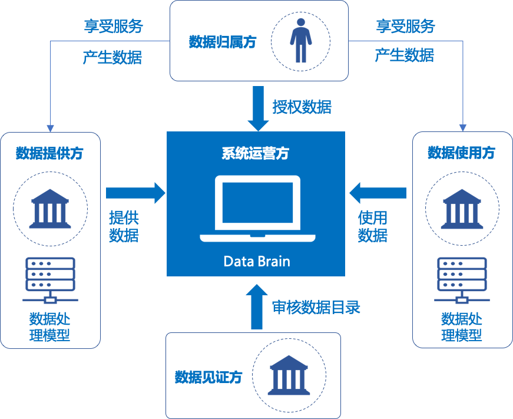

# DDCMS简介

DDCMS旨在多方协作场景中，面向数据管理需求，提供一套基于区块链的、安全可信、友好易用的分布式数据管理开源方案，服务于个人数据携带、企业间数据共享。各参与方围绕数据目录展开业务协作，使得各参与方能够快速、低成本的进行数据管理和共享、确保数据安全和隐私的同时，实现数据共享全流程可追溯、可监管、可审计。

# DDCMS 角色介绍

在DDCMS中包括5中角色：数据归属方、数据提供方、数据使用方、数据见证方、系统运营方。

- 数据归属方：在数据传输共享过程中，对数据使用方的数据请求进行数据授权，在数据提供方进行授权管理。
- 数据提供方：对外提供数据目录服务，负责审核数据目录使用申请及核验用户授权。
- 数据使用方：对数据归属者提供服务，并经过授权通过数据目录获取数据。
- 数据见证方：负责对数据目录的全流程进行进行审核监管，不参与具体业务。
- 系统运营方：负责对各参与方进行KYC，确保参与方可信可靠。

# DDCMS功能概述

DDCMS包括三个功能模块：统一可信的数据目录管理、可追溯审计的数据传输过程管理、丰富安全的数据处理组件管理。**当前仅开源统一可信的数据目录管理模块。**

### 统一可信的数据目录管理

提供统一的数据目录管理功能，所有操作均上链存证，确保数据目录可信，提升管理和运营效率，降低接入成本。

### 可追溯审计的数据传输过程管理

每次数据的传输过程均会记录上链，确保数据流通的定量、定时、定场景，实现全流程可管理可追溯可监管审计。

### 丰富安全的数据处理组件管理

提供对各种数据处理组件的管理能力，企业可按需接入和使用，避免二次开发、降低接入和使用成本。

# 各子工程简介

DDCMS包含三个子工程：

- [DDCMS-Contract](https://github.com/WeBankBlockchain/DDCMS-Contract)
- [DDCMS-Service](https://github.com/WeBankBlockchain/DDCMS-Service)
- [DDCMS-Front](https://github.com/WeBankBlockchain/DDCMS-Front)

### DDCMS-Contract

DDCMS-Contract是DDCMS的智能合约实现，对接入用户、业务、数据目录等提供链上审核及管理等能力。

- [Github地址](https://github.com/WeBankBlockchain/DDCMS-Contract)
- [Gitee地址](https://gitee.com/WeBankBlockchain/DDCMS-Contract)

### DDCMS-Service

DDCMS-Service是DDCMS的后端工程，采用JAVA编写，提供和DDCMS-Contract的交互能力及账户、业务、数据目录的管理能力。

- [Github地址](https://github.com/WeBankBlockchain/DDCMS-Service)
- [Gitee地址](https://gitee.com/WeBankBlockchain/DDCMS-Service)

### DDCMS-Front

DDCMSn-Front是一个前端项目，采用React编写，提供可视化注册、登录、业务注册、审核、数据目录注册、审核、展示、查看及管理等功能。

- [Github地址](https://github.com/WeBankBlockchain/DDCMS-Front)
- [Gitee地址](https://gitee.com/WeBankBlockchain/DDCMS-Front)

# 快速开始

具体使用方式，请参考[快速开始](https://ddcms-docs.readthedocs.io/en/latest/).

# 贡献代码

欢迎参与本项目的社区建设：
- 如项目对您有帮助，欢迎点亮我们的小星星(点击项目右上方Star按钮)。
- 欢迎提交代码(Pull requests)。
- [提问和提交BUG](https://github.com/WeBankBlockchain/DDCMS/issues)。
- 如果发现代码存在安全漏洞，请在[这里](https://security.webank.com)上报。

# License

开源协议为[Apache License 2.0](http://www.apache.org/licenses/). 详情参考[LICENSE](../LICENSE)。
